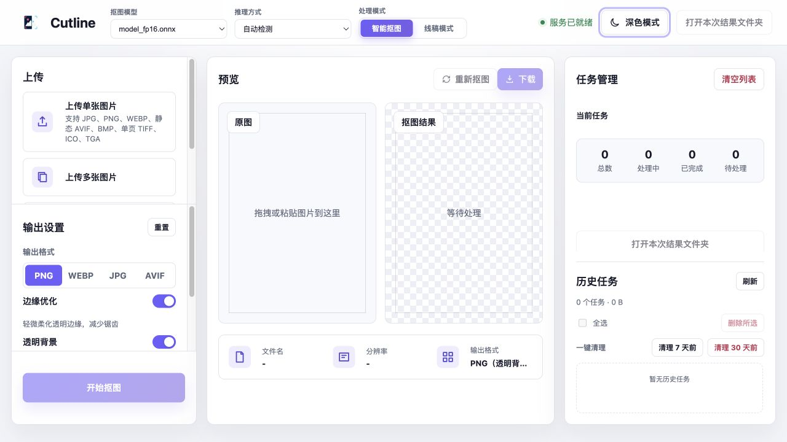
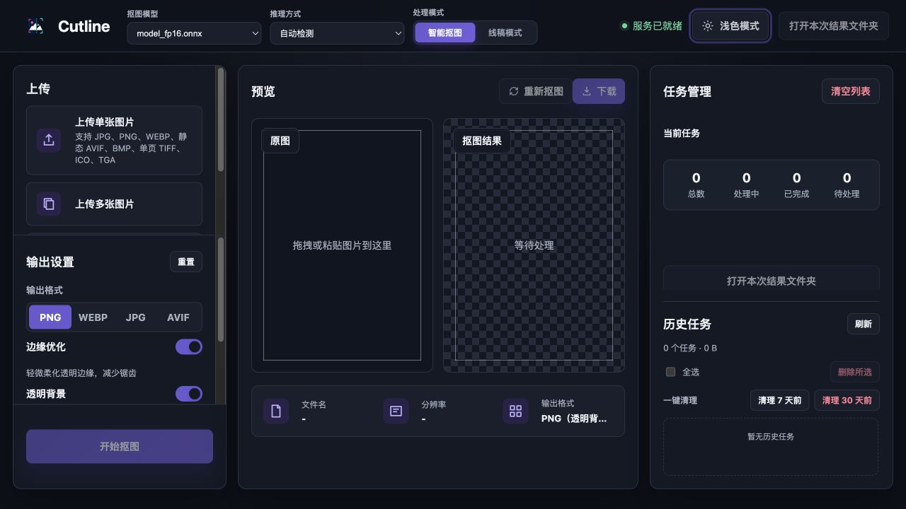

# Cutline ONNX

> [中文](README_ZH.md) | [English](README.md)

<p align="center">
  
</p>

<p align="center"><strong>离线运行的 AI 图片抠图工具</strong></p>

<p align="center">
  <a href="LICENSE"></a>
  
  
</p>

**Cutline**（网站名：**Cutline 本地抠图**）在你的电脑上运行兼容 ONNX 的背景移除模型。图片、模型与输出始终留在本机；浏览器只是本地操作界面。

## 界面预览

### 亮色主题



### 暗色主题



## 为什么选择 Cutline

- **本地优先**：服务仅监听 `127.0.0.1`，不上传原图、模型或处理结果。
- **批量处理**：单张、多选与文件夹递归导入，处理结果与任务记录可恢复。
- **可控输出**：支持 PNG、WebP、JPG、AVIF；可选透明背景、背景色与边缘优化。
- **跨平台推理**：自动选择 CPU、NVIDIA CUDA 或 macOS CoreML，也可手动指定。
- **两种模式**：智能抠图使用 ONNX 模型；线稿模式不依赖模型，适合签名与简洁线稿。

## 快速开始

> 推荐 Python 3.12。CPU 模式兼容 Python 3.11–3.13；Windows CUDA 建议使用 Python 3.12。

1. 下载你有权使用的 RMBG-2.0 ONNX 模型，放到项目根目录的 `models/`。
2. 安装当前平台依赖。
3. 运行启动脚本，浏览器会打开本地界面。

```text
models/
  model_fp16.onnx
```

模型来源：[Hugging Face](https://huggingface.co/briaai/RMBG-2.0) · [ModelScope 魔搭](https://www.modelscope.cn/models/AI-ModelScope/RMBG-2.0)。仓库不包含模型权重；使用前请阅读[第三方与模型授权说明](THIRD_PARTY_NOTICES.md)。

## 主要功能

- 智能抠图，支持 PNG、WebP、JPG 或 AVIF 输出
- 输入支持 JPG、PNG、WebP、静态 AVIF、BMP、单页 TIFF、ICO 和 TGA
- 透明背景线稿提取
- 多图和文件夹批量处理
- 支持 CPU、NVIDIA CUDA 和 macOS CoreML
- 任务恢复、结果预览和历史清理

## 准备工作

推荐使用 **Python 3.12**。CPU 模式兼容 Python 3.11–3.13；Windows CUDA 建议使用 Python 3.12。

本项目不包含模型权重。请准备兼容的 RMBG-2.0 ONNX 模型，并将一个或多个 `.onnx` 文件放入项目根目录的 `models/` 文件夹：

```text
models/
  model_fp16.onnx
  model_other.onnx
```

启动优先使用 `--model`，其次恢复上次成功加载的模型，最后选择文件名排序最靠前的模型。成功加载后由服务端保存选择。

模型来源：

- [Hugging Face](https://huggingface.co/briaai/RMBG-2.0)
- [ModelScope 魔搭](https://www.modelscope.cn/models/AI-ModelScope/RMBG-2.0)

模型许可与项目源码许可不同，使用前请阅读[第三方与模型授权说明](THIRD_PARTY_NOTICES.md)。

## 安装依赖

以下命令均在项目根目录执行。

### Windows + NVIDIA CUDA

在 PowerShell 中执行：

```powershell
py -3.12 -m venv .venv
.\.venv\Scripts\python.exe -m pip install --upgrade pip
.\.venv\Scripts\python.exe -m pip install -r .\requirements\windows-cuda.txt
```

### Windows CPU

```powershell
py -3.12 -m venv .venv
.\.venv\Scripts\python.exe -m pip install --upgrade pip
.\.venv\Scripts\python.exe -m pip install -r .\requirements\cpu.txt
```

### macOS

```bash
python3 -m venv .venv
.venv/bin/python -m pip install --upgrade pip
.venv/bin/python -m pip install -r requirements/macos.txt
```

### Linux CPU

```bash
python3 -m venv .venv
.venv/bin/python -m pip install --upgrade pip
.venv/bin/python -m pip install -r requirements/cpu.txt
```

### Linux + NVIDIA CUDA

```bash
python3 -m venv .venv
.venv/bin/python -m pip install --upgrade pip
.venv/bin/python -m pip install -r requirements/linux-cuda.txt
```

## 一键启动

Windows：

```powershell
.\scripts\start_windows.ps1
```

macOS：

```bash
./scripts/start_macos.sh
```

Linux：

```bash
./scripts/start_linux.sh
```

启动脚本会自动选择可用的运行方式并打开浏览器。停止服务时，在终端按 `Ctrl+C`。

## 模型运行管理与故障诊断

启动脚本只启动本地 Web 管理服务；模型运行在**独立推理进程**中。切换模型或推理方式时，系统先确认旧推理进程退出，再启动新进程。切换期间不接受新任务；已有任务不会被强制终止。新模型加载失败时，系统会尝试自动恢复原模型。

没有模型时，服务仍会打开浏览器，并显示绝对 `models/` 目录、放置说明和下载链接：[RMBG-2.0 ONNX](https://huggingface.co/briaai/RMBG-2.0/tree/main/onnx)。下载和使用前请确认模型许可证。

推理方式为自动检测、CPU、NVIDIA CUDA 与 Apple CoreML。Apple CoreML 可能使用 CPU、GPU 或 ANE，也可能回退 CPU，不能把它称为 GPU 专用模式。

运行失败时会展示故障时可用内存、进程 RSS，以及可测量时的 CUDA 空闲/总显存。错误文本只能表示“可能原因”；只有 Python `MemoryError` 才显示为“已确认”。

ONNX Runtime 的内存模式默认保持启用。`--disable-mem-pattern` 仅作为受控测量开关，不代表能减少模型权重内存。请在相同模型、推理方式和输入集下分别执行：

```bash
./scripts/start_macos.sh --provider cpu
./scripts/start_macos.sh --provider cpu --disable-mem-pattern
```

记录启动 RSS、首次推理峰值、十张同尺寸图片后的稳定 RSS 和总耗时；不要使用 `tracemalloc` 证明 ONNX Runtime 的原生内存。

## 使用方法

1. 在“输出设置”中选择 `models/` 文件夹里的抠图模型。
2. 选择“智能抠图”或“线稿模式”。
3. 添加图片或选择文件夹。
4. 设置输出格式等选项，然后开始处理。
5. 在页面中预览结果，或打开结果目录。

处理结果保存在 `outputs/<任务ID>/results/`。刷新页面后可以恢复最近任务。

## 常用参数

| 参数 | 默认值 | 说明 |
| --- | --- | --- |
| `--models-dir` | `models` | 前端可选模型目录 |
| `--model` | 自动选择 | 可选；覆盖启动时首次加载的模型路径 |
| `--output-dir` | `outputs` | 结果目录 |
| `--provider` | `auto` | `auto`、`cpu`、`cuda` 或 `coreml` |
| `--port` | `8765` | 本地端口 |
| `--max-upload-mb` | `1024` | 最大上传容量，单位 MB |

macOS/Linux 可以将参数直接附加到启动脚本。例如，在 CPU 模式下使用端口 `9000`：

```bash
./scripts/start_macos.sh --provider cpu --port 9000
```

完整参数：

```bash
.venv/bin/python rmbg_onnx_runner/web_app.py --help
```

## 环境检查

macOS/Linux：

```bash
.venv/bin/python rmbg_onnx_runner/check_env.py --model models/model_fp16.onnx --provider auto
```

Windows CUDA：

```powershell
.\.venv\Scripts\python.exe .\rmbg_onnx_runner\check_env.py --model .\models\model_fp16.onnx --provider cuda
```

如果 CUDA 无法加载，先将 `--provider` 改为 `cpu`，确认模型和基础流程可以正常运行。

## 常见问题

- **找不到模型**：确认 `models/` 中至少存在一个 `.onnx` 文件，或通过 `--model` 指定启动模型。
- **CUDA 不可用**：确认使用的是 Python 3.12，并检查 NVIDIA 驱动及环境检查结果中的 `CUDAExecutionProvider`。
- **浏览器没有打开**：停止服务，确认系统已设置默认浏览器后重新启动。
- **端口被占用**：程序会尝试后续端口，也可以通过 `--port` 指定其他端口。
- **重新安装依赖**：删除或移走 `.venv`，然后重新执行对应平台的安装命令。

## 输出与历史任务

每个任务的文件结构如下：

```text
outputs/<任务ID>/
  manifest.json
  _uploads/
  results/
```

右侧“任务管理”会显示历史任务的时间、状态、图片数和占用空间。可以查看任务详情、单个删除、复选批量删除，也可一键清理 7 天前或 30 天前的任务。删除前会显示任务数和可释放空间并要求确认；当前查看的任务和运行中任务不可删除。

`outputs/`、`.venv/` 和 `*.onnx` 不会提交到 Git。

## 安全与许可

服务只监听 `127.0.0.1`，不要通过反向代理暴露到局域网或互联网。安全说明见 [SECURITY.md](SECURITY.md)。

项目源码采用 [MIT License](LICENSE)。模型权重遵循其各自许可，本项目不会下载或分发模型。

## 开发与测试

```bash
python3 -m venv .venv
.venv/bin/python -m pip install -r requirements/dev.txt
.venv/bin/pytest
.venv/bin/ruff check .
```

## 发布

GitHub Release 只发布通过检查的源码标签，不包含模型、虚拟环境或用户输出。确认默认分支 CI 通过后，创建并推送语义化版本标签：

```bash
git tag -a v0.1.0 -m "v0.1.0"
git push origin v0.1.0
```

`v*` 标签会再次运行测试与 Ruff，再创建自动生成说明的 GitHub Release。发布前请确认标签指向预期提交，且仓库中没有模型权重、输出图片或本地环境文件。
